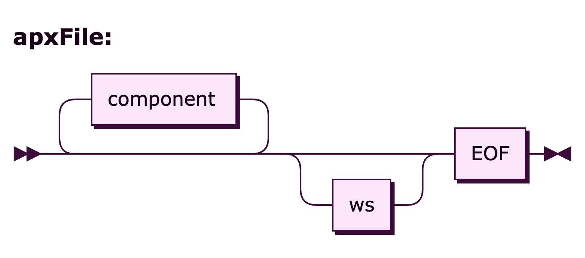

# APEXlang-Parser

## Introduction

APEXlang-Parser is an ANTLR-4-based parser for [APEXlang](https://docs.oracle.com/en/database/oracle/apex/26.1/apxdc/working-apexlang.html).
The parser requires a Java Virtual Machine supporting version 11 or newer and is available
on [Maven Central](https://central.sonatype.com/artifact/com.grisselbav/apexlang-parser).

## Scope

This parser is designed to be APEXlang version-agnostic.

While the grammar documented in the [API Reference](https://docs.oracle.com/en/database/oracle/apex/26.1/apxln/)
defines both the language structure and the valid APEXlang elements, 
the grammar in this repository is limited to structural concerns. 
Its purpose is to recognise and parse valid syntax. 
Semantic validation of language constructs is out of scope.

The goal is to provide a parser that can be used by linters such as [dbLinter](https://grisselbav.github.io/dbLinter/). 
It is not intended to replicate the semantic validation performed by the APEXlang compiler in 
[SQLcl](https://docs.oracle.com/en/database/oracle/sql-developer-command-line/26.1/sqcug/apexlang.html), 
[SQL Developer for VS Code](https://docs.oracle.com/en/database/oracle/sql-developer-vscode/26.1/sqdnx/working-apexlang-applications.html)
and [ORDS](https://docs.oracle.com/en/database/oracle/oracle-rest-data-services/26.1/orddg/).

## APEXlang Grammar

The syntax diagrams of the APEXlang grammar are produced by [RR](https://github.com/GuntherRademacher/rr)
and can be found [here](https://grisselbav.github.io/APEXlang-Parser/grammar.html).

## License

APEXlang-Parser is licensed under the Apache License, Version 2.0. You may obtain a copy of the License
at <http://www.apache.org/licenses/LICENSE-2.0>.
